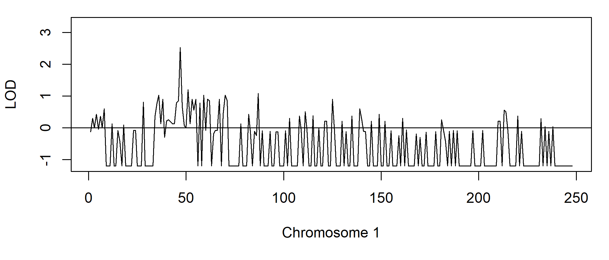

<!-- README.md is generated from README.Rmd. Please edit that file -->

# paramlink2

<!-- badges: start -->

[](https://CRAN.R-project.org/package=paramlink2)
[](https://cran.r-project.org/package=paramlink2)
[](https://cran.r-project.org/package=paramlink2)
<!-- badges: end -->

The goal of **paramlink2** is to perform parametric linkage analysis in
medical pedigrees. Both singlepoint and multipoint LOD scores are
supported (the latter requires
[MERLIN](https://csg.sph.umich.edu/abecasis/merlin/)). The package
includes tools for visualising LOD scores and summarising peaks for use
in downstream analysis.

**paramlink2** is part of the
[pedsuite](https://magnusdv.github.io/pedsuite/) collection of packages
for pedigree analysis in R, featured in the book [Pedigree Analysis in
R](https://www.elsevier.com/books/pedigree-analysis-in-r/vigeland/978-0-12-824430-2)
(Vigeland, 2021). Chapter 9 of this book gives an introduction to
linkage analysis, and includes a detailed worked example using
**paramlink2**.

As the package name suggests, **paramlink2** is a reimplementation of
[paramlink](https://CRAN.R-project.org/package=paramlink), which is no
longer actively maintained. The two version are not compatible, and all
users are strongly recommended to use **paramlink2**.

## Installation

To get the current official version of **paramlink2**, install from CRAN
as follows:

``` r
install.packages("paramlink2")
```

Alternatively, get the latest development version from GitHub:

``` r
# install.packages("devtools")
devtools::install_github("magnusdv/paramlink2")
```

## An example

``` r
library(paramlink2)
#> Loading required package: pedtools
```

The family below is affected with an autosomal dominant disorder. The
built-in dataset `dominant1` contains genotypes for 14 of the members,
at 248 SNP markers on chromosome 1. We will perform parametric linkage
analysis on the dataset, hoping to identify a genomic region linked to
the disease locus.


The dataset contains three elements: `ped`, `aff` and `map`. For
simplicity we store these in separate variables:

``` r
ped = dominant1$ped
aff = dominant1$aff
map = dominant1$map
```

The pedigree plot above was produced with the command

``` r
plot(ped, aff = aff, starred = typedMembers)
```

In order to compute LOD scores, we need to provide a disease model. This
is conveniently done with the function `diseaseModel()`. For this
example we use a fully penetrant autosomal dominant model:

``` r
modAD = diseaseModel("AD")

modAD
#> Autosomal inheritance
#> Penetrance: (f0, f1, f2) = (0, 1, 1)
#> Disease allele frequency: 1e-05
```

The `diseaseModel()` function contains a number optional arguments which
can be used to create more realistic models, including phenocopies,
reduced penetrance and liability classes. Consult the documentation
`?diseaseModel` for details about these!

Singlepoint LOD scores for the family are now computed as follows:

``` r
lods = lod(ped, aff = aff, model = modAD)
```

The `summary()` function prints the highest score:

``` r
summary(lods)
#> Max LOD score: 2.533179 
#> Achieved at marker(s): m47
```

Furthermore, `plot()` produces a nice graph of the LOD scores:

``` r
plot(lods)
```



As typical for singlepoint scores, the graph is quite noisy and not easy
to interpret, although we see indications of a peak. A cleaner picture
may be obtained by *multipoint* analysis, which is available if you have
MERLIN installed on your computer. A special wrapper, `merlinLod()`
takes care of all the input and output files to MERLIN, so that we never
have to leave R. Moreover, the syntax is similar to that of `lod()`
except that we may add a linkage map of the markers.

``` r
lodsM = merlinLod(ped, aff = aff, model = modAD, map = map)
```

The following command plots the MERLIN scores together with the
singlepoint scores:

``` r
plot(lods, col = 8)
points(lodsM, col = 2)
legend("topright", c("Multi", "Single"), col = c(2, 8), lwd = 2)
```


This graph shows a convincing peak of LOD = 3, which is close to the
traditional significance threshold LOD = 3.3 for AD disorders. We print
some details about the peak and its location:

``` r
peakSummary(lodsM, threshold = 2)
#>   CHROM FROM  TO  N FROM_MB TO_MB LEN TELO MAXLOD
#> 1     1  m34 m56 23      34    56  22        3.01
```

In other words, the disease locus is most likely somewhere on chromosome
1 between 34 Mb and 56 Mb.
